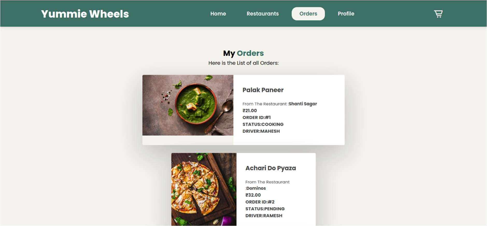

# Yummie Wheels
     
## Overview

Yummie wheels is a web application designed to facilitate the ordering and delivery of food from restaurants to customers. Built using PHP and running on a LAMP (Linux, Apache, MySQL, PHP) server, this project aims to provide a robust and scalable solution for managing restaurant menus, customer orders, and delivery processes.

## Features

- **User Management**: Register, login, and manage user accounts.
- **Restaurant Management**: Add and manage restaurant details and menus.
- **Order Management**: Place, view, and track orders.
- **Delivery Management**: Assign and manage delivery tasks.
- **Admin Dashboard**: Oversee system operations, manage users, restaurants, and orders.

## Requirements

- **Server**: LAMP stack (Linux, Apache, MySQL, PHP)/XAMPP
- **PHP Version**: 7.4 or higher
- **MySQL Version**: 5.7 or higher
- **Web Browser**: Modern browser for accessing the application (e.g., Chrome, Firefox)

## Installation on Windows

DOWNLOAD "Online Voting Management System Project"

1. Install [XAMPP](https://www.youtube.com/watch?v=VCHXCusltqI) and run Apache and MySQL services.

2. Download the Project Zip Folder

3. Extract the file and copy "yummie wheels" folder

4. Paste the folder from previous step inside `xampp/htdocs` directory inside your one of your drive where xampp is installed

5. Open PHPMyAdmin `http://localhost/phpmyadmin`

6. Create a database with name yw

7. Import yw.sql file (given inside the zip package in db folder)

8. Run the script 

9. Use the Following Credential to log into the Admin Session
   
   `username:  root
   
   `password:  

## Usage

1. **Access the Application**: 
	- Open a web browser and navigate to `http://localhost/` to   view the application.
    
2. **User Registration and Login**:
    
    - Users can register and log in to place orders and view their order history.
3. **Restaurant and Menu Management**:
    
    - Admins can add and manage restaurants and their menus through the admin dashboard.
4. **Order Placement and Tracking**:
    
    - Customers can place orders, track their status, and view delivery details.
  
## Screenshots:

`Schema Diagram:`

`Home Page:`

`Restaurants Page:`

`Cart/Orders Page:`

`Payment Page:`

`Bill Page:`

